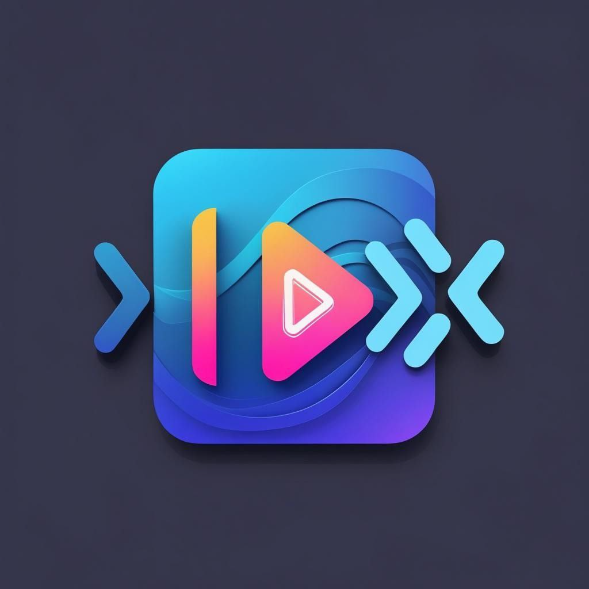
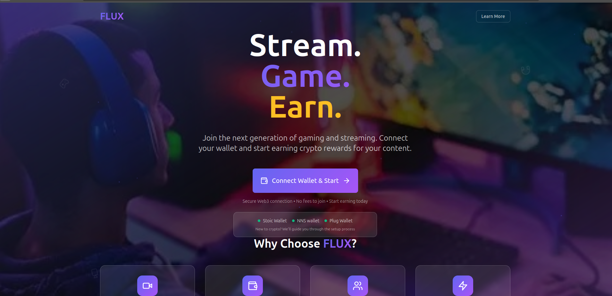
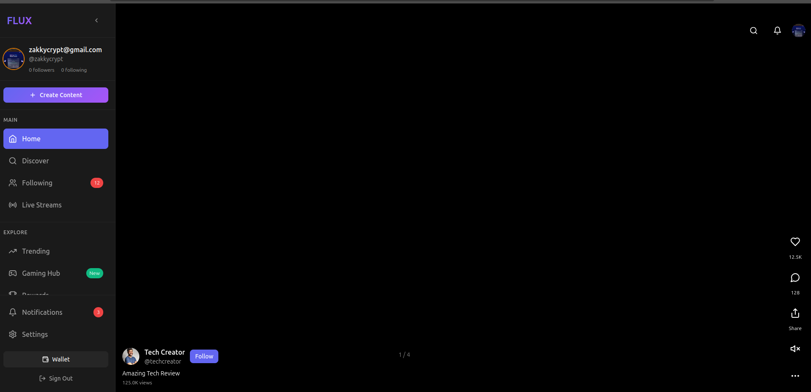
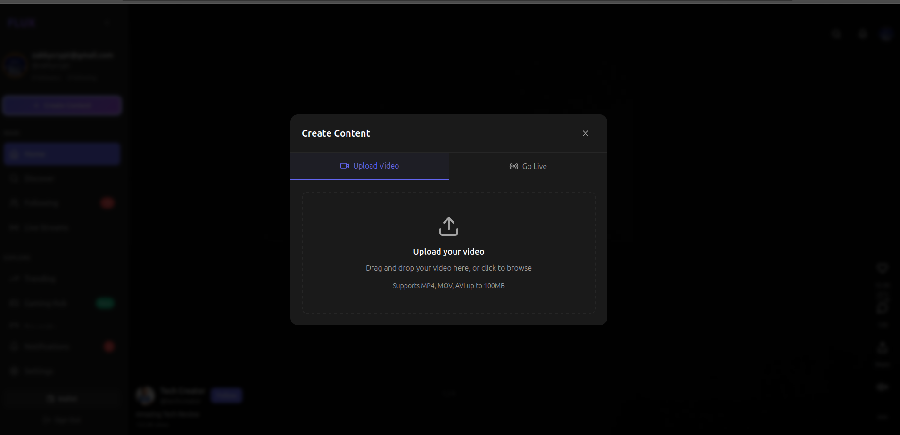
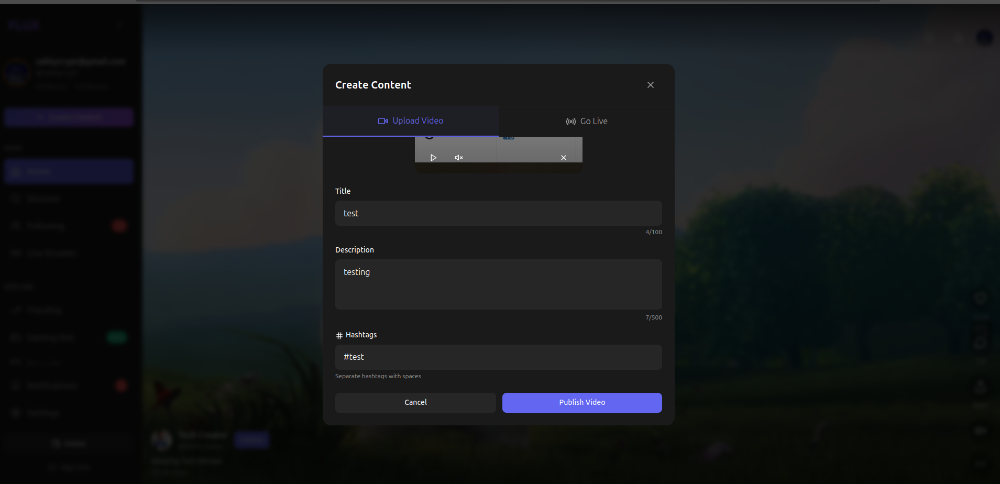

<p align="center">
  
</p>

# Flux

**Stream. Game. Earn.**

**Flux** is a decentralized Web3 platform built on the [Internet Computer](https://internetcomputer.org), enabling gamers and content creators to connect their crypto wallets, stream gameplay, and earn rewards in a secure, permissionless ecosystem.

---

## 📑 Table of Contents

- [Project Overview](#project-overview)
- [Screenshots](#screenshots)
- [Installation](#installation)
- [Running the Project Locally](#running-the-project-locally)
- [Development Workflow](#development-workflow)
- [Features](#features)
- [Wallet Integration](#wallet-integration)
- [Configuration](#configuration)
- [Documentation](#documentation)
- [Troubleshooting](#troubleshooting)
- [Contributing](#contributing)
- [License](#license)

---

## 🚀 Project Overview

Flux empowers the next generation of content creators through:

- Real-time **streaming** and **game sharing**
- **Crypto wallet integration** for on-chain rewards
- Secure, Web3-native experiences built using **Motoko** and the **DFINITY SDK**
- No middlemen, no platform fees — only content, connections, and crypto

---

## 🖼️ Screenshots

<p align="center">
  
  <br/>
  
  <br/>
  
  
</p>

> “Connect your wallet and start earning crypto rewards for your content.”

---

## 🛠 Installation

Make sure you have the following installed:

- [Node.js](https://nodejs.org/)
- [DFX SDK](https://internetcomputer.org/docs/current/developer-docs/setup/install)

Then:

```bash
npm install
````

---

## ▶️ Running the Project Locally

Start your local replica and deploy canisters:

```bash
# Start local replica
dfx start --background

# Deploy backend/frontend
dfx deploy
```

Access the app:

```text
http://localhost:4943/?canisterId=<asset_canister_id>
```

---

## ⚙️ Development Workflow

### Backend

Regenerate Candid interface after updating your Motoko code:

```bash
npm run generate
```

### Frontend

Start the development server:

```bash
npm start
```

Then open:

```text
http://localhost:3080
```

---

## ✨ Features

* 🎮 Stream your gameplay with minimal latency
* 🔗 Connect popular crypto wallets (Stoic, Plug, NNS)
* 💸 Earn rewards for your participation and engagement
* 💡 Built on the Internet Computer for speed, security, and scalability
* 🔄 Seamless frontend/backend sync using DFX

---

## 🔐 Wallet Integration

Flux will supports secure in the future as we ship more feature, Web3 wallet connections :

* ✅ **Stoic Wallet**
* ✅ **NNS Wallet**
* ✅ **Plug Wallet**

> New to crypto? Flux includes guidance to set up your wallet and connect securely.

---

## 🔧 Configuration

For production environments without DFX, be sure to:

### Option A: Webpack

```bash
export DFX_NETWORK=ic
```

### Option B: `dfx.json` override

```json
{
  "canisters": {
    "your_canister": {
      "declarations": {
        "env_override": "ic"
      }
    }
  }
}
```

---

## 📚 Documentation

* [Quick Start Guide](https://internetcomputer.org/docs/current/developer-docs/setup/deploy-locally)
* [DFX Developer Tools](https://internetcomputer.org/docs/current/developer-docs/setup/install)
* [Motoko Language Guide](https://internetcomputer.org/docs/current/motoko/main/motoko)

---

## 🧩 Troubleshooting

| Issue                       | Solution                               |
| --------------------------- | -------------------------------------- |
| Replica not starting        | Run `dfx stop` then `dfx start`        |
| Actor errors / stale candid | Run `npm run generate`                 |
| Frontend not connecting     | Check wallet permissions, canister URL |

---

## 🤝 Contributing

We welcome community contributions! Fork the repo, make your improvements, and submit a PR. For larger features, please open an issue first to discuss.

---

## 🪪 License

This project is licensed under the [MIT License](LICENSE).

---

<p align="center">
  Made with 💜 by the Flux team · Powered by Internet Computer
</p>

